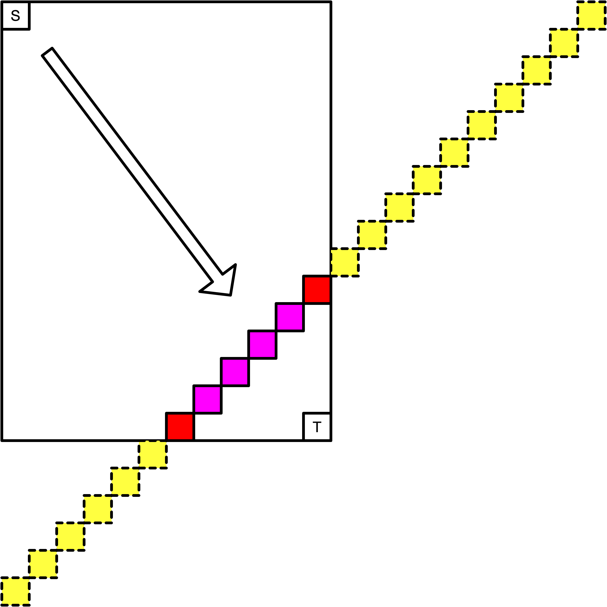
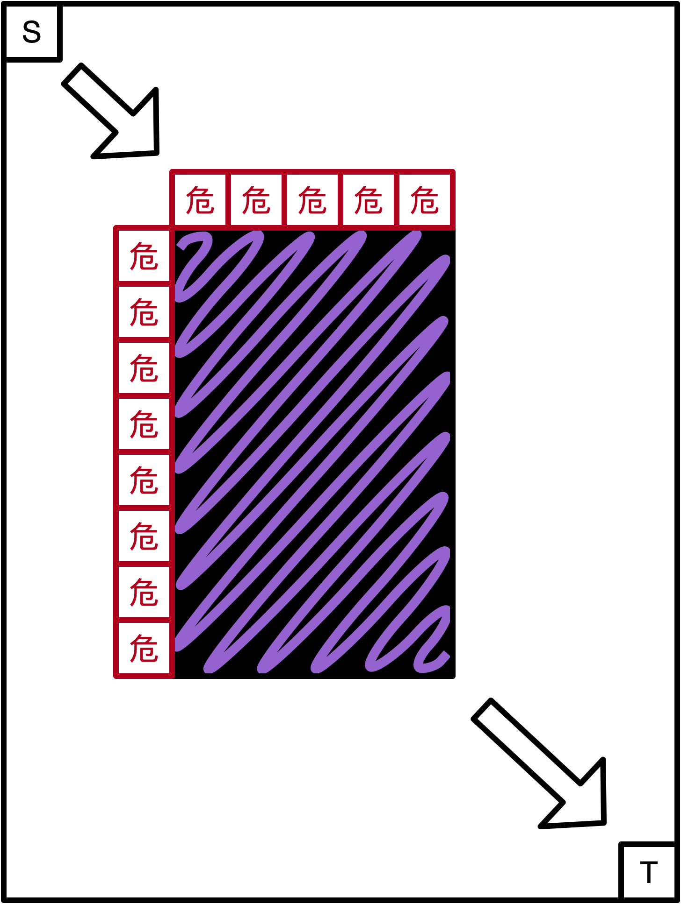

# Round B 简要题解

#### Bike Tour (5pts, 7pts)

- 考点：数组

- 难度：Easy-

- 题解：

    - 对数组中除了首位之外的元素进行判断即可。

#### Bus Routes (10pts, 13pts)

- 考点：小学奥数，贪心

- 难度：Easy+

- 题解：

    - 倒过来考虑所有的公交路线；

    - 如果现在是第 `D` 天的话，我们最晚可以在第 `D/X * X` 天乘坐间隔为 `X` 的公交，其中 `/` 表示整数除法；

    - 为了得到最晚的开始时间，肯定是每一班公交越晚乘坐越好，最晚的时间可以从上面的公式得到。

#### Robot Path Decoding (11pts, 16pts)

- 考点：字符串解析，栈

- 难度：Medium+

- 题解：

    - 数字相当于把括号内的动作重复若干次，因此可以想到使用递归对字符串进行解析：如果我们知道括号内的动作的相对移动为 `(X, Y)`，括号前的数字为 `k`，那么这整个部分的相对移动为 `(kX, kY)`；

    - 遇到一个数字时，可以知道后面要开始 `(...)` 重复动作了，递归层数加一；

    - 遇到一个 `)` 时，可以知道这一层的递归结束了，返回仅这一层 `(...)` 中的相对移动，递归层数减一；

    - 注意要对 `10^9` 取模。

#### Wandering Robot (14pts, 24pts)

- 考点：组合数

- 难度：Hard+

- 题解：

    - 我的做法和官方题解不太相同，但内在的逻辑是一致的。

    - 由于机器人只能向右或者向下走，所以如果它掉进洞里，那么掉落点只能是洞的第一行或者第一列。并且如果洞本身就在网格的第一行，那么机器人不可能掉在洞的第一行；同理如果洞本身就在网格的第一列，那么机器人不可能掉在洞的第一列；

    - 那么对于每个在洞的第一行或第一列的位置，我们求出机器人走到这里的概率，把它们求和即为机器人掉进洞里的概率，再用 `1` 减去这个和就是机器人成功的概率了；

    - 这个概率怎么求呢？我们这里首先介绍一个公式：

        - 在一个无限大的网格中，从左上角 `(1, 1)` 开始走若干步，每一步只能向右或者向下走，那么走到 `(x, y)` 的概率为 `C(x+y-2, x-1) / 2^(x+y-2)`，它也等于 `C(x+y-2, y-1) / 2^(x+y-2)`，其中 `C` 为组合数；

        - 这是因为走到 `(x, y)` 等价于向右走了 `y-1` 步，向下走了 `x-1` 步，总计 `x+y-2` 步。在 `x+y-2` 步中选择 `y-1` 步向右走的方案数即为组合数 `C(x+y-2, y-1)`，它也等于选择 `x-1` 步向左走的方案数 `C(x+y-2, x-1)`。我们算的是概率，就要用方案数除以总方案数，也就是 `x+y-2` 步的所有走法的总数 `2^(x+y-2)`；

    - 那么我们可以用这个公式求出每一个第一行或第一列对应位置的概率呢？其实是不行的，我们需要进行微调，这是因为下面的两个原因：

        - 我们的网格是 **有限大** 的，不能直接套用无限大网格的公式。以下图为例，当我们走了若干步之后，「黄色」的格子是在网格之外的，它们对应的概率会被边界（下边界和右边界）的两个「红色」的格子吸收，这是因为当我们走到下边界（右边界同理）的时候，以后的每一步都只能往右走了，也就是在无限大网格中走到「黄色」的位置，等价与在有限大网格中走到「红色」的位置。而「粉色」的格子的概率和无限大网格的结果是一致的。

         
        

        
        

         

        - 我们直接计算概率会有重复。举个例子，如果洞占据了网格的 `(10, 10) - (20, 20)` 的部分，我们使用组合数计算机器人掉在第一行的 `(10, 11)` 的概率时，包含了从 `(9, 11)` 向下走一步到 `(10, 11)` 的概率，以及从 `(10, 10)` 向右走一步到 `(10, 11)` 的概率，而后者机器人已经掉进 `(10, 10)` 了。因此我们需要按照下图所示的方法计算概率。下图中的所有「危」都是洞的第一行或第一列的相邻位置，在走到任意一个「危」之前，机器人都不会掉进洞中。而走到「危」之后，机器人会有 `1/2` 的概率（如果「危」不在下边界或右边界）或 `100%`（如果「危」在下边界或右边界）掉进洞中。

         
        

        
        

         
    
    - 经过上面的分析，算法就呼之欲出了：

        - 我们找出所有的「危」；

        - 对于每一个「危」，如果它不在下边界或右边界，那么我们套用无限大网格的公式计算机器人走到「危」的概率，并乘以 `1/2`；如果它在下边界或右边界，那么我们需要加上走到网格外部的概率。注意最多只会有两个「危」在下边界或右边界，因此对算法的时间复杂度不会造成影响，即时间复杂度为线性的。

    - 最后一个问题就是，当 `x` 和 `y` 的值很大的时候，我们如何计算 `C(x+y-2, y-1) / 2^(x+y-2)` 呢？这里就要用到一个套路了，我们可以对这个概率取自然对数：

        - `Pr = C(x+y-2, y-1) / 2^(x+y-2) = (x+y-2)! / (y-1)! / (x-1)! / 2^(x+y-2)`

        - `ln Pr = ln(x+y-2)! - ln(y-1)! - ln(x-1)! - (x+y-2)ln2`

        - 而 `ln k!` 就等于 `ln1 + ln2 + ... + lnk`，因此我们可以预处理出所有 `lnk` 的前缀和，这样就可以 `O(1)` 计算概率的自然对数，也就可以 `O(1)` 得到概率了。